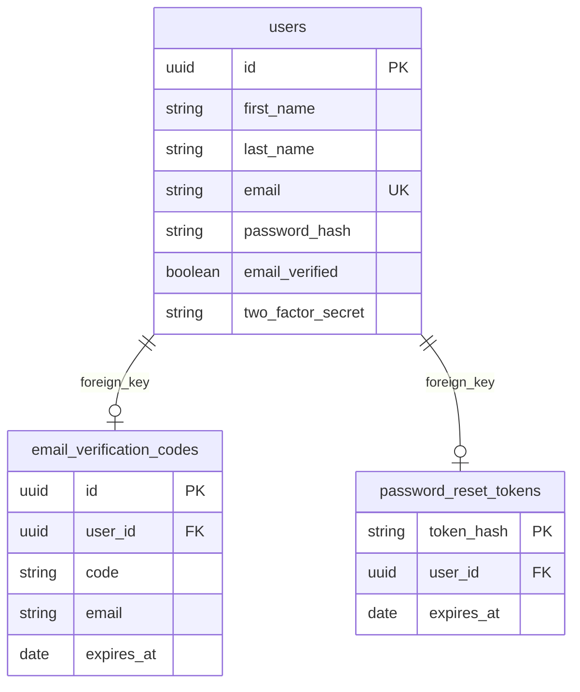

# ERD

```mermaid
erDiagram
  users {
    uuid id PK
    string first_name
    string last_name
    string email UK
    string password_hash
    boolean email_verified
    string two_factor_secret
  }

  email_verification_codes {
    uuid id PK
    uuid user_id FK
    string code
    string email
    date expires_at
  }

  password_reset_tokens {
    string token_hash PK
    uuid user_id FK
    date expires_at
  }

  users ||--o| email_verification_codes : foreign_key
  users ||--o| password_reset_tokens : foreign_key
```
