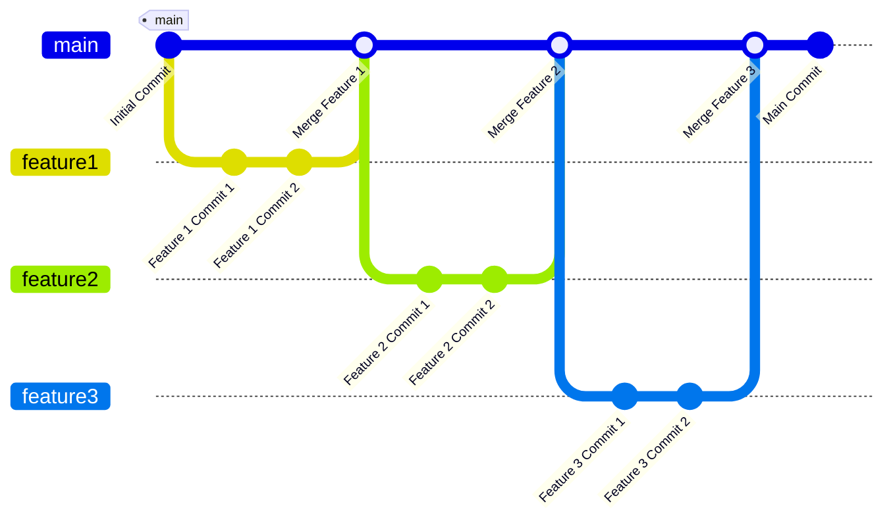

# Trunk Based Development

Trunk-based development (TBD) is a software development strategy where all developers collaborate on code in a single branch called "trunk" (or "main"). Instead of creating long-lived feature branches, developers commit changes directly to the trunk or create short-lived branches that are quickly merged back into the trunk. This approach aims to reduce integration challenges and improve software delivery speed and quality.

## Key Concepts of Trunk Based Development
1. **Single Integration Point:** The trunk is the main branch where all changes are integrated. This ensures a single source of truth and minimizes conflicts.
2. **Frequent Commits:** Developers commit changes frequently (often several times a day) to ensure the codebase remains up-to-date and conflicts are resolved quickly.
3. **Short-Lived Feature Branches:** If feature branches are used, they are short-lived and merged back into the trunk as soon as possible, typically within a day or two.
4. **Automated Testing:** Continuous integration (CI) is crucial in TBD. Automated tests run on every ~~commit~~ PR to ensure the codebase remains stable.
5. **Code Reviews:** Code reviews are performed promptly to maintain code quality and facilitate knowledge sharing.

## Importance of Trunk Based Development
- **Reduced Integration Headaches:** Frequent integration ensures that conflicts are resolved quickly, reducing the risk of significant merge conflicts.
- **Continuous Delivery:** TBD facilitates continuous integration and continuous delivery (CI/CD) practices, enabling faster and more reliable releases.
- **Improved Collaboration:** Developers work closely together, which improves communication and collaboration within the team.
- **Higher Code Quality:** Frequent commits and automated testing help maintain high code quality.

## Downsides of Trunk Based Development

- **Discipline Required:** Developers need to be disciplined about writing tests and committing code frequently.
- **Potential for Instability:** Without proper CI/CD practices, the trunk can become unstable, affecting the entire team.
