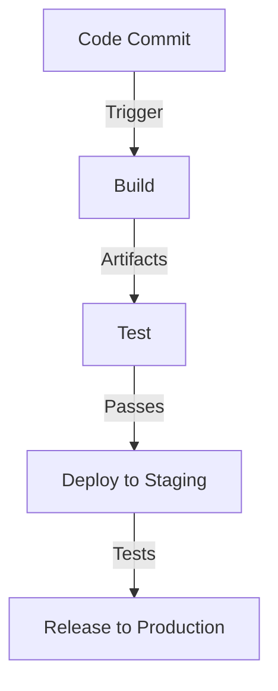

# CI/CD

Continuous Integration (CI) and Continuous Deployment (CD) are software development practices aimed at improving the development process, increasing efficiency, and ensuring software quality.

## Continuous Integration (CI)

CI is the practice of frequently integrating code changes into a shared repository. With CI, developers regularly merge their code changes into a central repository, where automated builds and tests are triggered. This allows teams to identify and fix integration errors quickly, ensuring that the codebase is always in a working state. Key components of CI include:

- **Automated Builds:** Automatically compiling the code to create executable software.
- **Automated Tests:** Running a suite of tests to verify that the code changes haven't introduced any regressions.
- **Version Control:** Using a version control system (e.g., Git) to manage changes and facilitate collaboration.

## Continuous Deployment (CD)

CD extends CI by automatically deploying code changes to production or staging environments after they pass through the CI pipeline. This enables teams to deliver new features and bug fixes to users rapidly and frequently. Key components of CD include:

- **Deployment Automation:** Automating the process of deploying applications to various environments.
- **Release Management:** Managing the release process, including versioning, rollback strategies, and monitoring.
- **Infrastructure as Code (IaC):** Defining infrastructure configurations in code to enable consistent and repeatable deployments.

## CI/CD Pipeline

A CI/CD pipeline is a series of automated steps that code changes go through, from development to deployment. It typically includes the following stages:

1. **Code Commit:** Developers push code changes to a version control repository.
2. **Build:** The CI server pulls the latest code, compiles it, and creates an executable artifact.
3. **Test:** Automated tests are run to validate the code changes.
4. **Deploy:** If all tests pass, the artifact is deployed to a staging environment for further testing.
5. **Release:** After successful testing in the staging environment, the changes are deployed to production.

## Benefits of CI/CD

- **Faster Time to Market:** Continuous integration and deployment enable rapid delivery of features and bug fixes.
- **Improved Quality:** Automated testing and deployment reduce the likelihood of introducing bugs into production.
- **Increased Collaboration:** CI/CD encourages collaboration among team members by promoting frequent code integration and feedback.
- **Better Feedback Loop:** Developers receive immediate feedback on their code changes, allowing them to address issues quickly.

In summary, CI/CD practices help development teams streamline their workflows, deliver higher-quality software, and respond to customer needs more effectively.
