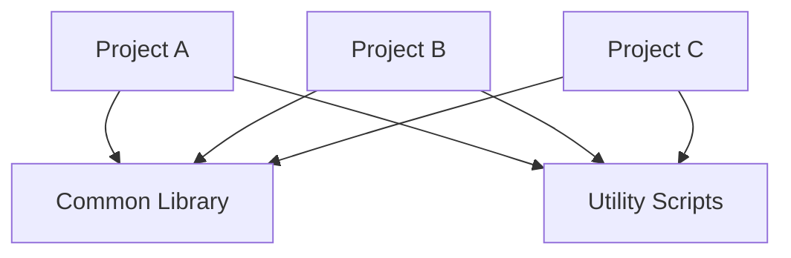

# Monorepo
A monorepo, short for "monolithic repository," is a version control strategy where multiple projects or components are stored within a single repository. This approach contrasts with the more common multi-repo strategy, where each project has its own separate repository.

## Key Features
- **Single Repository:** All code for multiple projects, libraries, or services is housed in one repository.
- **Unified Versioning:** Shared components can be versioned together, simplifying dependency management.
- **Consistent Development Workflow:** Developers use the same tools and processes across all projects, leading to consistency and potentially easier collaboration.
- **Simplified Dependency Management:** Interdependencies between projects can be managed more easily, as everything is in one place.
- **Atomic Changes:** Changes that span multiple projects can be made in a single commit, ensuring consistency across related projects.

## Benefits
- **Simplified Refactoring:** Refactoring code that affects multiple projects is easier because changes can be made and tested in one place.
- **Improved Code Sharing:** Shared libraries and components are easier to manage and reuse.
- **Consistent Tooling and Standards:** It’s easier to enforce coding standards, testing frameworks, and build processes across all projects.
- **Easier Onboarding:** New developers only need to learn one repository structure and set of tools.
- **Holistic View of the Codebase:** Developers have a complete view of all projects and their interactions, which can improve understanding and collaboration.

## Challenges
- **Scalability:** As the repository grows, it can become unwieldy and slow to manage. Performance issues can arise with very large monorepos.
- **Complexity in CI/CD:** Continuous integration and deployment pipelines can become more complex due to the increased size and interdependencies within the monorepo.
- **Access Control:** Managing access permissions can be more challenging when everything is in one place, especially if different teams need different levels of access.
- **Tooling Limitations:** Not all version control systems or tools handle large monorepos well. Special tools and configurations may be required.

## Examples
- **Google:** Known for having one of the largest monorepos in the world, Google uses a monorepo to manage most of its code.
- **Facebook:** Facebook uses a monorepo for much of its codebase, allowing for consistent development practices across its various projects.

## Conclusion
A monorepo can offer significant benefits in terms of code reuse, consistency, and ease of refactoring, especially for large organizations or projects with many interdependencies. However, it also comes with challenges, particularly around scalability and complexity, which need to be managed carefully. The choice between a monorepo and multiple repos should be made based on the specific needs and context of the projects and the organization.
